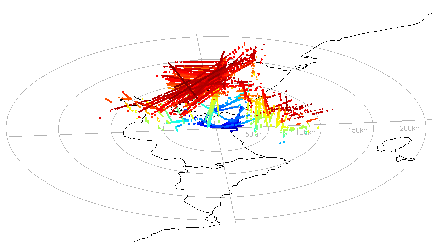
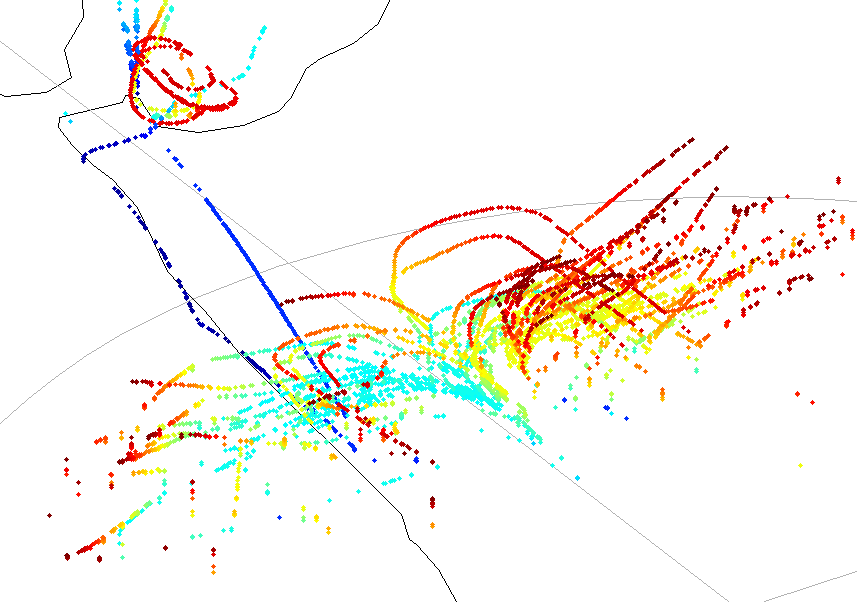
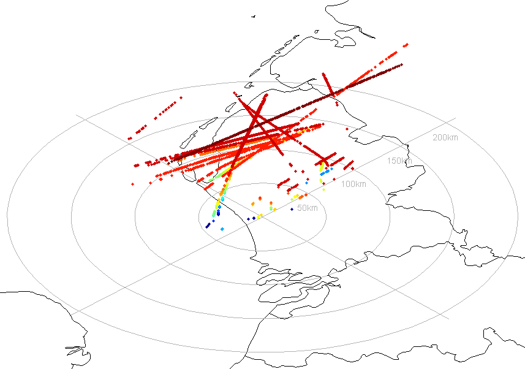

PlotRTL1090 
===========
*3D visualization of air traffic through RTL-SDR (dump1090) and MATLAB*

Summary
---
PlotRTL1090 is a simple MATLAB routine to record and visualize air traffic. It makes use of the excellent [`dump1090`](https://github.com/antirez/dump1090) by @antirez which profits from the ability of a ~$6 USB DTV receptor (RTL-SDR) to relay raw radio data along a wide spectrum, including the 1090 MHz frequency in which aircraft broadcast ADS-B messages indicating their callsign, altitude, speed, position, etc.

The code is provided on a single file for convenience, but the actual use is divided in two phases. The first portion of the code contains a loop that polls a running [`dump1090`](https://github.com/antirez/dump1090) server (or forks!) to read the JSON transcript of decoded ADS-B messages and store them in a `.mat` file. You can resume this loop at any time to collect additional data (which will be timestamped for your convenience). When enough data is recorded, you can execute the second code cell to render the data into a 3D visualization (which will be also saved as a `.gif` and `.mp4`).

Requirements
---
A server running [`dump1090`](https://github.com/antirez/dump1090) to record ADS-B data. For those who don't have (yet!) an RTL-SDR dongle available, two sample datasets are provided to test the code. Those have been used to generate the renders shown on the following section. 


Example results
---
The file `coords` contains a recording of air traffic around the Valencia area (LEVC) in Spain. The file `coords_nl` has been supplied by [/u/theodric](https://www.reddit.com/user/theodric) of [/r/RTLSDR](https://www.reddit.com/r/RTLSDR) using this code near Amsterdam-Schiphol (EHAM) area in The Netherlands. Using these files some sample renderings are shown below.

* **Valencia Airport (LEVC):** using the default options of the provided MATLAB script, the following render can be reproduced:


* **Amsterdam-Schiphol Airport (EHAM):** in order to use the data from Schiphol, we must also modify the bullseye center and select which land contours to plot. In this case the most simple option is to select all countries (the render time will be increased):
```matlab
load('coords_nl');
centerLoc = [52.3147007,4.755935]; 
countries = shaperead([SHPdir 'ne_10m_admin_0_countries.shp'],'UseGeoCoords', true);
```


* **Holding, approach and take off patterns (EHAM):** just by filtering the plotted data by altitude, we can avoid the very crowded high altitude airways and focus on landing/take off operations. Operations from the small Den Helder airport can also be seen:
```matlab
filter = alt < 5000; % feet
```


* **Airlines: Ryanair (EHAM):** the filter can contain more elaborate expressions! For instance, let's use a regular expression to select only flights operated by the blue-and-white irish low cost. As you can see in the following figure, the irish airline appears to avoid using the Schiphol airport, as only high altitude flighs can be seen:
```matlab
filter = cellfun(@(x) ~isempty(regexpi(x,'^RYR.*$')),flg);
```


> Tip: you can concatenate logical expressions in the filter! You could for example select only Ryanair flights operating under 5000 ft by making `filter = cellfun(@(x) ~isempty(regexpi(x,'^RYR.*$')),flg) & alt < 6000;`. Any combination of altitude, speed, position, callsign, etc. is available!

Licensing
---
This code is licensed under GPL v3.
